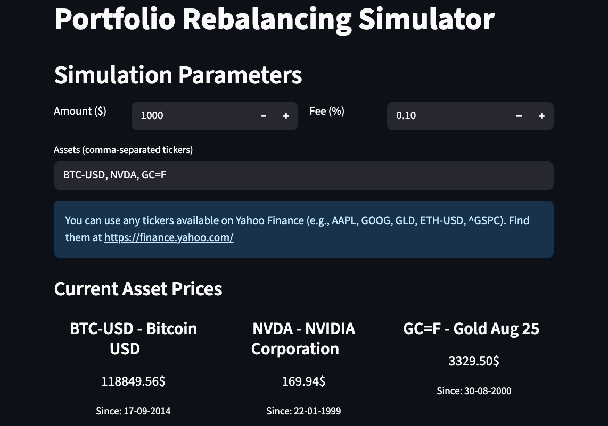
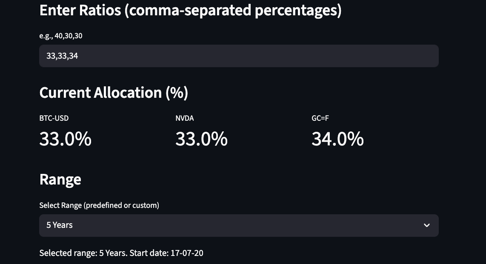
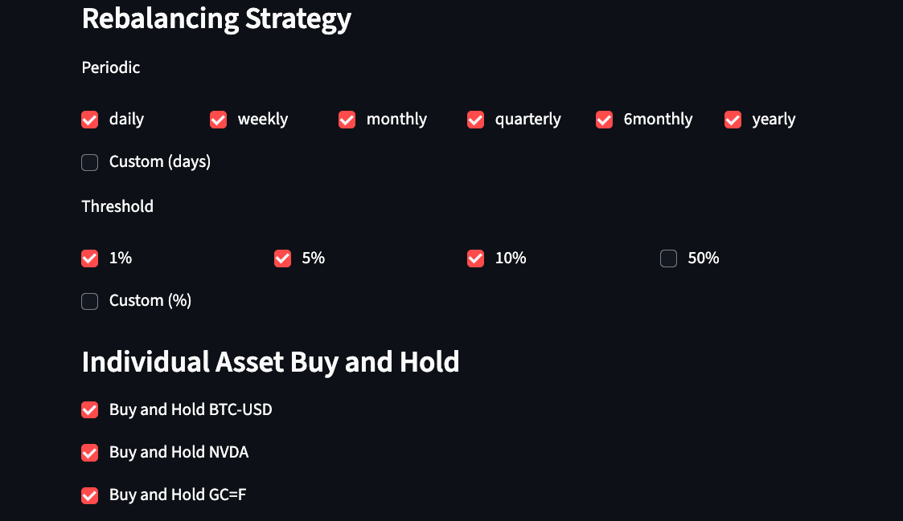
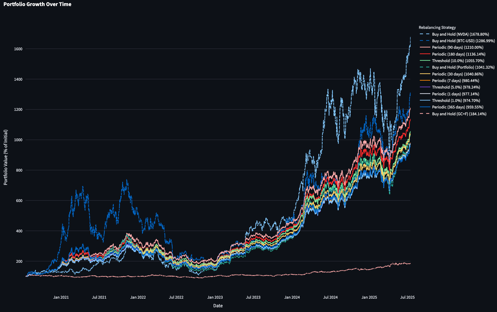
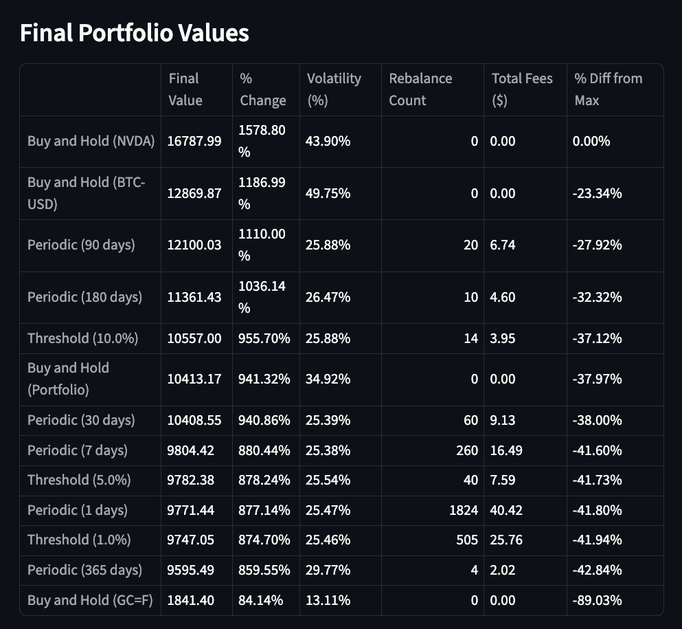

# Portfolio Rebalancing Simulator

This application simulates and visualizes the performance of different portfolio & assets (from yahoo finance) rebalancing strategies based on historical market data.

## Features

- **Define Your Portfolio:**
  - Set the initial investment amount.
  - Add multiple assets tickers to the portfolio (e.g., BTC-USD, GLD, ETH-USD).



- **Select Allocation & Simulation Range:**
  - Specify the desired asset allocation ratio using a slider or text input.
  - Use predefined time ranges (e.g., 5 years, 3 years, 1 year, 6 months, 1 month).
  - Define a custom date range for the simulation.



- **Choose Rebalancing Strategies:**
  - **Periodic Rebalancing:** Set a fixed time interval for rebalancing (daily, weekly, monthly, quarterly, yearly, or custom days). All periodic options are on by default.
  - **Threshold Rebalancing:** Rebalance the portfolio whenever an asset's weight deviates by a certain percentage (e.g., 0.1%, 1%, 5%, 10%, 50%, or custom %). All threshold options are on by default.

- **Individual Asset Buy and Hold:** Simulate buy and hold for individual assets alongside portfolio strategies.



- **Visualize Results:**
  - Run the simulation to see how your portfolio would have performed.
  - Compare the performance of different rebalancing strategies on an interactive chart.
  - Graph lines for individual asset Buy and Hold strategies are styled differently for better visibility.
  - Final portfolio values table includes % Change, Volatility (%), and % Difference from Max.



- **final portfolio value**
  - a table with final portfolio value, % change, volatility, rebalance count, total fee and % difference from max.

 

- **Data Caching:** Historical data fetched from `yfinance` is cached locally for faster subsequent simulations.

## Tech Stack

- **Backend:** Python
  - **Web Framework:** Streamlit - for creating the interactive web interface.
  - **Data Handling:** Pandas - for data manipulation and analysis.
  - **Numerical Operations:** NumPy - for calculations.
  - **Financial Data:** yfinance - to fetch historical market data for assets.
- **Charting:** Plotly - for creating interactive visualizations of the simulation results.

## Getting Started

### Prerequisites

- Python 3.8+
- Pip

### Installation

1.  **Clone the repository:**
    ```bash
    git clone https://github.com/untko/portfolio_rebalance_simulator
    cd portfolio_rebalance_simulator
    ```

2.  **Create and activate a virtual environment:**
    ```bash
    python -m venv venv # create new virtual environment in the current directory
    source venv/bin/activate  # activate it, On Windows use `venv\Scripts\activate`
    ```

3.  **Install the dependencies:**
    ```bash
    pip install -r requirements.txt
    ```

### Running the Application

1.  **Run the Streamlit app:**
    ```bash
    streamlit run app.py
    ```

2.  Open your web browser and navigate to the URL provided by Streamlit (usually `http://localhost:8502`).